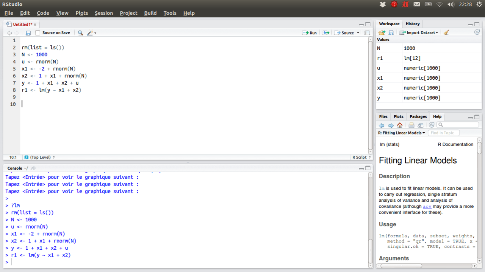
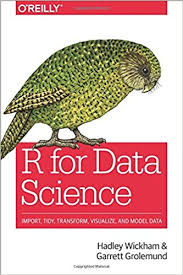
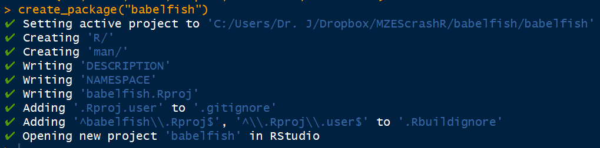

```{r setup, include = FALSE}
library(learnr)
tutorial_options(exercise.eval = FALSE,
                 exercise.checker = TRUE,
                 exercise.completion = TRUE,
                 exercise.diagnostics = TRUE)
knitr::opts_chunk$set(error = TRUE)
library(tidyverse)
library(devtools)
library(roxygen2)
```


# Introduction

## Instructors
##### Denis Cohen
- Postdoctoral Fellow, MZES, Data and Methods Unit
- denis.cohen@mzes.uni-mannheim.de
- [denis-cohen.github.io](https://denis-cohen.github.io)
- [\@denis_cohen](https://twitter.com/denis_cohen)
- +49 621 181 2876
<br>

##### Julian Bernauer
- Postdoctoral Fellow, MZES, Data and Methods Unit
- julian.bernauer@mzes.uni-mannheim.de
- [julianbernauer.github.io](https:/julianbernauer.github.io)
- [\@julianbernauer](https://twitter.com/julianbernauer)
- +49 621 181 2853

## Setup
##### Today
- For today's class, our slides will feature interactive exercises, which
we will collectively discuss and solve
- You may follow along at 
[https://shinyapps.io/denis-cohen/rintro/](https://shinyapps.io/denis-cohen/rintro/)
(available for the duration of the class)

##### Using the class materials at a later point
- Install the most recent version of [R](https://cran.r-project.org/mirrors.html)
- Install the most recent version of 
[RStudio](https://www.rstudio.com/products/rstudio/download/#download)
- From within RStudio, install required packages:
```{r, eval = FALSE}
install.packages(c('learnr', 'tidyverse', 'devtools', 'roxygen2'))
```
- Retrieve the script and data files from 
[https://github.com/denis-cohen/rintro/](https://github.com/denis-cohen/rintro/)
- Compile `rintro.Rmd` from within RStudio

## Program
1. R and RStudio 
2. Algebraic operators and transformation
3. Boolean, logical, and relational operators
4. Object types and conversions
5. Control structures
6. Writing simple functions
7. Installing, updating, and using packages
8. Getting help in R
9. Data import and export
10. A glimpse on the tidyverse package
11. A quick first self-authored package in R 


# 1. R and RStudio

## Why R?
{width="560" height="315"}

## RStudio
[RStudio](https://www.rstudio.com/products/rstudio/download/#download)
is a powerful integrated development environment (IDE) and graphical user 
interface (GUI) for R. 

RStudio offers numerous useful features:

- window docking
- graphical workspace
- key bindings (keyboard shortcuts)
- tab completion (auto-completion)
- syntax highlighting
- code diagnostics
- knitr and Rmarkdown integration

## RStudio GUI
```{r rstudio-gui, echo = FALSE, out.width = "100%"}

```


# 2. Algebraic Operators and Transformation

## Numeric Classes
R features two fully compatible (main) *types* (storage modes) for numbers:

- `integer` for integers
- `double` for real numbers

```{r num_1, include=TRUE}
x <- 9     # a real number
y <- 4L    # an integer
```

```{r num_2, exercise = TRUE, exercise.lines = 1}
sapply(list(x, y), typeof)
```

While both are of different storage *types*, they are of the same *class*:

```{r num_4, exercise = TRUE, exercise.lines = 1}
sapply(list(x, y), class)
```

## Artihmetic Operators and Common Transformations
```{r ari, include=TRUE, eval=FALSE}
x+y     # addition
x-y     # subtraction
x*y     # multiplication
x/y     # division
x^y     # exponentiation
x%%y    # modulus
x%/%y   # integer division
log(x)  # natural logarithm
exp(x)  # exponential
sqrt(x) # square root
```

## Exercise
1. Generate an integer `a`, assigning the value 2
1. Generate a real `b`, assigning the value 0.9
1. Generate a scalar `c`, $c = \log (b^a)$
1. Print the value of `c`
1. Ascertain that `c` is a numeric of class double

```{r ariex, exercise = TRUE} 
a <- 2L
b <- .9
```

```{r ariex-solution}
a <- 2L
b <- .9
c <- log(b^a)
c
is.double(c)
```


# 3. Boolean, Logical, and Relational Operators

## Boolean Operators 
```{r boolean, echo = FALSE, out.width = "100%"}
knitr::include_graphics("images/transform-logical.png")
```

## Logical and Relational Operators
```{r logrel, exercise = TRUE}
3 + 4 == 7              # Does 3 + 4 equal 7?
2 + 5 < 6               # Does 2 + 5 equal 6?
3 + 4 <= 2 + 5          # Is 3 + 4 less than/equal to 2 + 5?
isFALSE(3 + 4 != 2 + 5) # Is it false that 3 + 4 is not equal to 2 + 5?
3 | 4 >= 2 + 1          # Is 3 OR 4 greater than/equal to 2 + 1?
3 & 4 >= 2 + 1          # Are 3 AND 4 greater than/equal to 2 + 1?
3 & 7 %in% c(1:5)       # Are 3 AND 7 included in an integer sequence from 1 to 5?
```


# 4. Object Types and Conversions 

## Characters
An object of type `character` is a language object
```{r char_1, include = TRUE}
start <- "R is so much"
end <- "fun!"
sentence <- paste(start, end, sep = " ")
```

Run these three commands and establish their purpose:
```{r char_2, exercise = TRUE}
# Before you start, print the sentence in place of this comment
typeof(sentence)
nchar(sentence)
grepl("fun", sentence)
```

```{r char_2-solution}
sentence
class(sentence)
nchar(sentence)
grepl("fun", sentence)
```

## Vectors
A vector is a serial listing of *atomic* objects 
(e.g. of type `integer`, `double`, `logical`, or `character`)
<br>

Examples:
```{r vec1_1}
item <- c("flour", "sugar", "potatoes", "tomatoes", "bananas")
price <- c(.99, 1.49, 1.99, 2.79, 1.89)
pricey <- price > 1.5
```

```{r vec1_2, exercise = TRUE}
item
price 
pricey
```


## Numeric Vectors and Linear Algebra
- A length-$N$ numeric vector in R is usually a column vector. So 
the following is *mostly* of dimensions $3 \times 1$
```{r vec2_1}
a <- c(0, 1, 2)
```
- Yet sometimes, when (pre-)multiplying other vectors or matrices, R will 
automatically transpose the vector on the left to ensure conformability:
```{r vec2_2, include=TRUE, eval=TRUE}
a %*% a
```

- So the above yields the inner product $\mathbf{a}^{\prime} \mathbf{a}$,
a scalar (dimensions $1 \times 1$) and *not* the outer product $\mathbf{a}\mathbf{a}^{\prime}$,
a matrix of dimensions $5 \times 5$

## Row and Column Vectors as Matrices
- You can ensure unambigous dimensions by defining vectors as matrices

```{r vec3_1, exercise=TRUE}
as.matrix(a)
```
```{r vec3_2, exercise=TRUE}
## Note: t() transposes vectors and matrices
as.matrix(t(a))
```

## Matrices
A matrix is a rectangular arrangement of atomic objects
<br>

Example I:
```{r mat1_1}
mat1 <- matrix(seq(-.35, .35, .1), nrow = 2, ncol = 4)
```

```{r mat1_2, exercise = TRUE}
mat1 
```

*Note:* By default, we fill the $8$ elements of the $2 \times 4$ matrix by columns. 
Specify the option `byrow = TRUE` if you want to fill by rows instead.

## Matrices
A matrix is a rectangular arrangement of atomic objects
<br>

Example II:
```{r mat2_1}
mat2 <- rbind(item, substr(item, start = 1, stop = 3))
```

```{r mat2_2, exercise = TRUE}
mat2
```

## Matrices
A matrix is a rectangular arrangement of atomic objects
<br>

Example III:
```{r mat3_1}
mat3 <- cbind(price > 1.5, price < 1)
```

```{r mat3_2, exercise = TRUE}
mat3
```

## Arrays
An array is a multidimensional arrangement of atomic objects. 

Example: A 3D array of dimensions $3 \times 2 \times 2$
```{r arr1_1}
K <- 3L
L <- 2L
M <- 2L
ary3D <- array(rnorm(K*L*M, mean = 0, sd = 1), dim = c(K, L, M))
```

```{r arr1_2, exercise = TRUE}
## Try slicing, e.g. ar3D[, 1, 1], ar3D[c(1, 3), , ], etc.
ary3D
```

## Arrays
You may think of an array as a generalization of a vectors/matrices to any number of dimensions:

* all elements are of the same storage type
* fixed dimensional structure
* any vector or matrix can be stored as an array using `as.array()`
* without collapsing dimensions
    + a 1D array can be stored as a vector using `as.vector()`
    + a 2D array can be stored as a matrix using `as.matrix()`

## Lists
Lists allow you to store objects of various classes, various storage types, and various sizes.
Very useful, e.g., for returning various outputs from a function.

Example:
```{r list1_1}
mylist <- list()
mylist$char.mat <- matrix(LETTERS, nrow = 2, ncol = 13)
mylist$vectors <- list()
mylist$vectors$num.vec1 <- c(1:2)
mylist$vectors$num.vec2 <- runif(10, min = 0, max = 1)
mylist$isLame <- TRUE
```

```{r list1_2, exercise = TRUE, exercise.lines = 2}
sapply(mylist, class)
sapply(mylist$vectors, length)
```


## Data Frames
Data frames are essentially lists of variables of equal length, producing a
rectangular structure. Unlike matrix columns, data frames columns can be of
different storage types and classes.  

```{r df}
groceries <- data.frame(
  item = c("flour", "sugar", "potatoes", "tomatoes", "bananas"),
  price = c(.99, 1.49, 1.99, 2.79, 1.89)
)
groceries
sapply(groceries, class) # change function argument to "typeof"
```


# 5. Control Structures

## Control Structures in R
1. if, else, ifelse
1. for
1. while
1. repeat
1. break
1. next
1. return

...we will only focus on a few here.

## for-loop
```{r for, exercise = TRUE}
for (i in 1:nrow(groceries)) {
  print(paste0("Item ", i, ": ", groceries$item[i]))
}
```

## while-loop
Say we only have EUR 5 to spend...
```{r while-ex, exercise = TRUE}
i <- 0L
expenses <- 0.0
while (expenses <= 5.0) {
  print(paste0("We've spent EUR ", expenses, " on ", i, " items!"))
  i <- i + 1L
  expenses <- expenses + groceries$price[i]
}
```

Problem being...
```{r while, include = FALSE}
i <- 0L
expenses <- 0.0
while (expenses <= 5.0) {
  print(paste0("We've spent EUR ", expenses, " on ", i, " items!"))
  i <- i + 1L
  expenses <- expenses + groceries$price[i]
}
```
```{r while2, exercise = TRUE}
print(paste0("Total expenses: ", expenses))
```

## for-loop with break
```{r break, exercise = TRUE}
expenses <- 0
for (i in 1:nrow(groceries)) {
  expenses <- expenses + groceries$price[i]
  print(paste0("We've spent EUR ", expenses, " on ", i, " items!"))
  if (expenses + groceries$price[i + 1] >= 5) {
    print("No more!")
    break
  }
}
print(paste0("Final item count: ", i, "; Total expenses: ", expenses))
```

## if, else
Let's re-establish which foods are pricey ($\geq 1.50\text{EUR})$ ...

```{r if, exercise = TRUE}
for (i in 1:nrow(groceries)) {
  if (groceries$price[i] >= 1.5) {
    print(paste0("Item ", i, ": Sooooo pricey!"))
  } else {
    print(paste0("Item ", i, ": Sooooo cheap!"))
  } 
}
```

## Vectorization: ifelse
For efficiency gains, we may vectorize the operation:

```{r if2, exercise = TRUE}
ifelse(groceries$price >= 1.5, "pricey", "cheap")
```

This returns also a vector.


# 6. Writing Simple Functions

## Calculating the mean
*Reminder* That's what we're looking for... $\bar{x} = \frac{1}{N} \sum_{i=1}^{N} x_i$

1. Complete the function below.
2. Calculate and display the mean price of items in `groceries`

```{r mean, exercise = TRUE}
mymean <- function(x, check.input = TRUE) {
  if (check.input) {
    if (!(is.numeric(x) & length(x) >= 2L)) stop("x must be a numeric vector")
  }
  N <- length(x)
  mean.x <- ...
  return(mean.x)
}
... # use the function to calculate the mean

```

```{r mean-solution}
mymean <- function(x, check.input = TRUE) {
  if (check.input) {
    if (!(is.numeric(x) & length(x) >= 2L)) stop("x must be a numeric vector")
  }
  N <- length(x)
  mean.x <- 1/N * sum(x)
  return(mean.x)
}
mymean(groceries$price) # use the function to calculate the mean
```

*Note:* `x` and `check.input` are **arguments**. The argument `check.input` defaults to `TRUE`.
Whatever the function returns is called the **value**


# 7. Installing, Updating, and Using Packages

## Installing and updating packages 

### Generally
- Packages are written and contributed by the users 
- Packages are hosted on [CRAN](https://cran.r-project.org/)
- December 4, 11.30: "13518 available packages"

### Manual installation and updates 
- In RGui, you can set a mirror and download as well as update packages via the menu 
- In RStudio, via Tools -> Install Packages/Check for Package Updates 

## Installing and using packages 
Install the package once:

```{r instapack, eval=FALSE}
install.packages("foreign")
```

*Packages live in the library*

```{r library, eval=FALSE}
library(foreign)
```


# 8. Getting Help in R

## A list of suggestions 
- General help: `help.start()`
- Demos, for instance for graphs: `demo(graphics)`
- Examples, for instance for linear regression: `example(lm)`
- On a specific function: type `?lm` or `help(lm)`
- Sear help for keywords: `help.search("lm")`
- (Reference card)[https://cran.r-project.org/doc/contrib/Short-refcard.pdf]

*Or ask the internet (Stack Overflow...) or your DMU!*


# 9. Data Import and Export

## Getting them data in
**"Printed data allows patient people like us to type them"**

[memorized from some statistics textbook]


## Input types
- For Stata data (.dta): Use `library(foreign)` and `read.dta()`
- For comma separated values (.csv) data such as created from Excel: Use `read.csv()` or `read.table()`
- Other: Excel, SAS, SPSS...

### Example of getting some data in and writing data

- US 2016 election results from [The Guardian](https://www.theguardian.com/us-news/ng-interactive/2016/nov/08/us-election-2016-results-live-clinton-trump?view=map&type=presidential)
- Also using data from the [US Census](https://www.census.gov/prod/cen2010/briefs/c2010br-06.pdf)

## read.table() and read.csv()
- Almost identical
- Different defaults
    + `read.table()`: `header = FALSE, sep = ""`
    + `read.csv()`: `header = TRUE, sep = ","`
    + `read.csv2()`: `header = TRUE, sep = ";"`
    + This implies that `read.table()` = `read.csv(header = FALSE, sep = "")`

Check out the help file for `read.table()`
```{r read_table, exercise = TRUE}
?read.table()
```

## Typical use of `read.csv()`

Reading in some .csv data
```{r csv}
us16 <- read.csv("us16.csv")
```

What kind of object does `read.csv()` generate?
```{r class, exercise = TRUE}
class(us16)
```

Sometimes, you want to see the money
```{r viewer, exercise = TRUE}
View(us16)
```

## `write.csv()`
```{r write, eval = FALSE}
write.csv(us16, "us16.csv", row.names = FALSE)
```

`write.csv2()` uses a comma for the decimal point and a semicolon for the separator

## `read.dta()`, `read.dta13()`
- Function `read.dta()` from package `foreign` works up to Stata 12
- Package `read.dta13()` from package `readstata13` also reads Stata 13-15
- Package `haven` by Hadley Wickham also handles SPSS/SAS
- You can also export data in Stata as .csv or use the `saveold()` command

## `write.dta()`
Write a .dta data set using `write.dta()` from package `foreign`
```{r dta, eval = FALSE}
library(foreign)
write.dta(us16, "us16.dta")
```

## By the way... .Rdata!
Save and load a single object as .Rdata using `write()`

```{r, eval = FALSE}
write(us16, file = "us16.Rdata")
load("us16.Rdata")
```

Alternatively, save multiple objects using `save()`

```{r, eval = FALSE}
save(groceries, us16, file = "intro_dataframes.Rdata")
```

Or save the whole workspace with all objects:

```{r, eval = FALSE}
save.image(file = "rintro.Rdata")
```


# 10. A Glimpse on the tidyverse Package

## Tidyverse
```{r wickgrole, echo = FALSE, out.width = "25%"}

```

- Based on Wickham and Grolemund (2017): R for Data Science
- Available electronically via UB Mannheim

Loading the package (previously installed)
```{r tidyverse, eval = FALSE}
library(tidyverse)
```

## Motivation
**"R is an old language, and some things that were useful 10 or 20 years ago now get in your way" (Wickham and Grolemund 2017: 119)**

**"The packages in the tidyverse share a common philosophy of data and R programming, and are designed to work together naturally" (Wickham and Grolemund 2017: xvi)**

* All tidyverse packages can be loaded with the meta-package "tidyverse"
* Examples of what's in there
    + ggplot2 (great plots)
    + dplyr (data transformation)
    + tibble (intuitive data frames)
    + lubridate (date and time)
    + and many more...
* Here: example of tibbles, dealing e.g. with the notorious factor issue


## tibbles
**"Tibbles are a modern take on data frames. They keep the features that have stood the test of time, and drop the features that used to be convenient but are now frustrating (i.e. converting character vectors to factors)."**

* Tibbles **are** data frames
* But data frames like you want them to be

```{r tibblevignette, exercise = TRUE}
vignette("tibble")
```

## tibble vs. data.frame: string to factor
Data frame from earlier example
```{r us16_class}
us16 <- read.csv("us16.csv")
class(us16)
```

## tibble vs. data.frame: string to factor
Variable "state" is factor
```{r checkfactor, exercise = TRUE}
is.factor(us16$state)
us16$state
```

## tibble vs. data.frame: string to factor
* "Factors in R are stored as a vector of integer values with a corresponding set of character values to use when the factor is displayed."
* Factor can be fine if you like to include a variable in a regression
* It's also more storage efficient, but today that's not much of an issue
* But often, you want e.g. "character string" for plotting
* You could also change the default in `read.csv` (option "stringsAsFactors")
* Or go
    + `state_chr <- as.character(us16$state)`
    + `is.factor(state_chr)`
* Here, tibbles from the tidyverse are introduced as an alternative which does not automatically converts strings to factors and has further features


## tibble vs. data.frame: string to factor
Coerce conventional data frame to tibble
```{r totibble}
us16_tib <- as_tibble(us16)
class(us16_tib)
is.factor(us16_tib$state)
```
* Different class
* "state" still a factor -> tibble does not change data

## tibble vs. data.frame
Creating a data.frame and a tibble from vectors, of which state is character

Create single vectors of the desired type

```{r footgoer_1}
state_chr <- as.character(us16$state)
trump <- us16$trump
south <- us16$south
black <- us16$black
```

Data frame
```{r dffac, eval = TRUE}
us16_2 <- data.frame(state_chr,trump,south,black)
class(us16_2)
is.factor(us16_2$state_chr)
```

## tibble vs. data.frame

Tibble
```{r tibfac, eval = TRUE}
us16_tib2 <- tibble(state_chr,trump,south,black)
class(us16_tib2)
is.factor(us16_tib2$state_chr)
```

## Printing tibbles

Printing tibbles - nicer than for data.frame
```{r printtib, exercise = TRUE}
print(us16_tib2)
```


# 11. A Quick First Self-Authored Package in R

## A first glimpse on package creation
**Following a [tutorial by Hilary Parker](https://hilaryparker.com/2014/04/29/writing-an-r-package-from-scratch)**

*Note: We do not create a package live, as this requires the creation of local folders and files and some manipulations*

Some packages needed to create packages
```{r packages, eval=FALSE}
library(devtools)
library(roxygen2)
```
- `devtools`: "Tools to Make Developing R Packages Easier"
- `roxygen2`: "describe your functions in comments next to their definitions and roxygen2 will process your source code and comments to produce Rd files in the man/ directory"

## I thought it's so hard!

*When I grow up, I want to have a package called babelfish*

**This one line of code will create a package**

```{r, eval=FALSE}
create_package("babelfish")
```
Note: In Hilary Parker's tutorial, the old command `create()` is used

## What's created in the package?
```{r creapack, echo = FALSE, out.width = "100%"}

```

- A few system files (.Rhistory, .gitignore...) -> let's ignore these for now
- This also creates a project named `babelfish`. R projects store context information such as the preferred working directory... -> Not crucial now
- File `NAMESPACE`: Organizes the objects in the package so that we can call them by their name
- More interesting: File `DESCRIPTION` -> General information on the package to be edited externally
- More interesting: Folders `R` and `man` -> These store functions and documentation

## Editing `DESCRIPTION`
***Recorded before the show***
```
Package: babelfish
Title: What the Package Does (One Line, Title Case)
Version: 0.0.0.9000
Authors@R:
    person(given = "First",
           family = "Last",
           role = c("aut", "cre"),
           email = "first.last@example.com")
Description: What the package does (one paragraph).
License: What license it uses
Encoding: UTF-8
LazyData: true
RoxygenNote: 6.1.1
```

## Editing `DESCRIPTION`
***Becoming an author***
```
Package: babelfish
Title: Cross-Lingual Quantitative Text Analysis
Version: 0.0.0.9000
Authors@R:
    person(given = "Julian",
           family = "Bernauer",
           role = c("aut", "cre"),
           email = "julian.bernauer@gmail.com")
Description: A package for cross-lingual quantitative text analysis using machine translation and topical scaling.
License: What license it uses
Encoding: UTF-8
LazyData: true
RoxygenNote: 6.1.1
```

## Functions and Documentation
- In the following, we write a short function and save it as
`~/babelfish/R/babelfish_cat.R`
- A header contains documentation information, e.g.:
    + \@param: arguments used
    + \@examples: displays a few examples...

```{r cat_fun, eval = TRUE}
#' A Cat Function
#'
#' This function allows you to express your love of cats.
#' @param love Do you love cats? Defaults to TRUE.
#' @keywords cats
#' @export
#' @examples
#' cat_function()
#' cat_function(love=FALSE)

cat_function <- function(love=TRUE){
  if(love==TRUE){
    print("I love cats!")
  }
  else {
    print("I am not a cool person.")
  }
}
```

## Documentation and Installation
We change the working directory to the package directory...
```{r changewd, eval=FALSE}
setwd("babelfish")
```

...process the function documentation (to be stored in `man`)...
```{r documentation, eval=FALSE}
document()
```

...move back up to the parent directory and install the package:
```{r install, eval=FALSE}
setwd("..")
install("babelfish")
```

```{r hidden, eval = TRUE, include = FALSE}
load_all("babelfish")
```

## The package is now ready to go!
Check out the help file for `cat_function()`

```{r cathelp, exercise=TRUE}
?cat_function
## Note: The package is not on CRAN (what a shame!), hence a local .html will open
```

And try the function:

```{r catex, exercise=TRUE}
## Run, change the argument to FALSE, then rerun
cat_function(love=TRUE)
```
